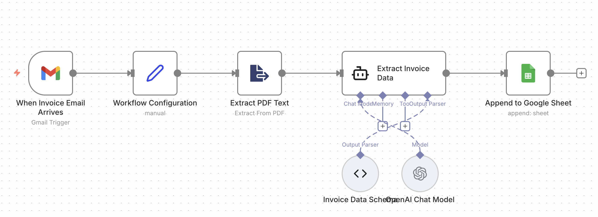

# data_pipeline_service



----
## Why this code exists (for n8n workflows)

You don’t “need” this code to make n8n work.
You need it to keep your workflow sane, reusable, and demo-ready once things stop being trivial.

### 1. What n8n is good at (and where it breaks)

n8n is excellent at:

* triggering workflows (email, webhook, upload)
* moving data between systems
* simple mapping and branching
* orchestration

n8n is not good at:

* complex parsing / cleaning logic
* validation and schema guarantees
* reusable business logic
* versioned, testable code
* anything you want to reuse across workflows

Once you put logic into Function nodes:

* it becomes copy-paste code
* it has no versioning
* it’s hard to test
* it’s painful to explain to others
* it turns into a black box

### 2. What this Python service gives you that n8n cannot

This code exists to own the logic, not the workflow.

It gives you:

* a single place where “cleaning” is defined
* strict input/output shape
* predictable behavior
* real error traces
* the ability to test logic without n8n
* something you can put on GitHub and hand to someone else

In short: **n8n calls it, but doesn’t think.**

### 3. Why n8n calls this instead of doing it itself

In the workflow, n8n should do only this:

> “I received something.
> Here is the text.
> Please process it and tell me the result.”

Everything else happens here:

* parsing
* validation
* normalization
* persistence
* export

That separation is intentional.
n8n remains replaceable. Your logic does not.

### 4. Why this matters for demos, clients, and future you

Without this service:

* every workflow duplicates logic
* small changes require editing multiple nodes
* you cannot say “this is our processing engine”
* you cannot test or debug cleanly
* you cannot reuse logic outside n8n

With this service:

* workflows become thin and readable
* logic changes in one place
* behavior is predictable
* debugging is fast
* you can run the same logic from curl, tests, or another system

This is production thinking.

### 5. The mental model (key idea)

Think of it like this:

* **n8n = control plane**
* **Python service = execution engine**

n8n decides **when** something happens.
This code decides **how** it happens.

### 6. If you removed this code tomorrow

Yes, you could:

* parse text in a Function node
* write to Sheets directly
* generate PDFs with hacks

But:

* every workflow would re-implement logic
* nothing would be reusable
* nothing would be testable
* nothing would scale
* nothing would look professional

You would have a workflow, not a system.

---

# Data Pipeline Side Service

A small FastAPI side-service for n8n (or any HTTP client).
It accepts raw text, cleans it, and then either stores it in SQLite, appends a row to Google Sheets, or generates a PDF.

The workflow logic lives in n8n.
This service only exposes stable HTTP endpoints.

---

## What it does

Send JSON with `source` and `text`.

Depending on the endpoint, the service will:

* clean and store data in SQLite
* clean and export data to Google Sheets
* clean and generate a PDF file

---

## Run locally

```bash
pip install -r requirements.txt
cp .env.example .env
uvicorn app.main:app --reload
```

Open API docs:

```
http://127.0.0.1:8000/docs
```

---

## Run with Docker

```bash
docker build -t data-pipeline-service .
docker run --rm -p 8000:8000 --env-file .env \
  -v $(pwd)/service_account.json:/app/service_account.json \
  -v $(pwd)/pipeline.db:/app/pipeline.db \
  data-pipeline-service
```

Notes:

* The `--env-file` flag picks up your API keys and `DATABASE_URL`.
* Mount the service account JSON so Google Sheets works.
* Mount the SQLite file if you want to keep data between runs.

---

## Environment variables

```ini
DATABASE_URL=sqlite:///./pipeline.db
GOOGLE_SHEETS_ID=YOUR_SHEET_ID
GOOGLE_SERVICE_ACCOUNT_FILE=service_account.json
```

If you use Google Sheets, share the target sheet with the service account email (Editor access).

---

## API endpoints

All endpoints are under `/pipeline`.

* `POST /pipeline/clean_store`
  Cleans input and stores it in SQLite

* `POST /pipeline/clean_to_sheets`
  Cleans input and appends a row to Google Sheets

* `POST /pipeline/clean_to_pdf`
  Cleans input and generates a PDF file

### Request body

```json
{
  "source": "manual-test",
  "text": "Invoice from ACME GmbH, amount 1999.99 EUR"
}
```

---

## How to test

### Swagger UI (recommended)

Open:

```
http://127.0.0.1:8000/docs
```

Click an endpoint → Try it out → paste JSON → Execute.

---

### Curl example

```bash
curl -X POST http://127.0.0.1:8000/pipeline/clean_store \
  -H "Content-Type: application/json" \
  -d '{"source":"test","text":"sample invoice"}'
```

### HTTP test from n8n (cloud or self-hosted)

1) Start the service (locally or in Docker) and expose it with a tunnel such as `ngrok http 8000`, or use its deployed URL.
2) In n8n, add a **Manual Trigger** node and an **HTTP Request** node.
3) Configure the HTTP node:
   - Method: POST
   - URL: `https://<public-host>/pipeline/clean_store` (or another endpoint)
   - Headers: `Content-Type: application/json`
   - Body (JSON): `{"source": "n8n-cloud-test", "text": "hello from n8n"}` (swap in your payload)
4) Click **Execute Node** to confirm you get a 200 response with cleaned data.

---

## n8n usage

Use an **HTTP Request** node in n8n:

* Method: POST
* URL: `http://<host>:8000/pipeline/<endpoint>`
* Body: JSON with `source` and `text`

This service acts as a reusable backend step inside your workflow.

---

## Quick connect from n8n (cloud or self-hosted)

1) Make the service reachable: run `uvicorn app.main:app --reload` locally and expose via a tunnel (e.g., `ngrok http 8000`), or deploy it (Render/Fly/Cloud Run/VPS). Note the public HTTPS base URL.
2) In n8n, add an **HTTP Request** node:
   - Method: POST
   - URL: `https://<your-host>/pipeline/clean_to_sheets` (or `clean_store` / `clean_to_pdf`)
   - Headers: `Content-Type: application/json`
   - Body (JSON): `{"source": "n8n", "text": {{$json["text"]}}}` (map your incoming text)
   - If you call `clean_to_pdf`, set the node response to file/base64 per your n8n version.
3) Set env vars on the server/container: `DATABASE_URL`, `GOOGLE_SHEETS_ID`, `GOOGLE_SERVICE_ACCOUNT_FILE`; share the Sheet with the service account email.
4) Optional: add an API key header and HTTPS if exposing publicly.

LLM prompt context (drop into your n8n LLM node):

```
You are part of an n8n workflow that processes invoice emails.
Raw text extracted from a PDF invoice will be provided.
Your task is to extract and normalize invoice information according to the given Invoice Data Schema.
Return only valid JSON that strictly matches the schema.
The output will be appended as a row in Google Sheets.
```

Connect the HTTP node after your LLM/output parser step to send the structured invoice text here.

---

## Notes

The cleaning logic is a placeholder.
Replace it with regex or LLM extraction without changing the API.

---

## n8n Invoice Processing Example

This n8n workflow demonstrates an automated invoice processing pipeline.

It shows how to go from an incoming invoice email to structured, spreadsheet-ready accounting data with minimal manual effort.

---

### High-level overview

When an invoice email arrives in Gmail, the workflow extracts the PDF attachment, converts it to raw text, uses an LLM to extract structured invoice fields according to a fixed schema, and appends the result to Google Sheets.

---

### Workflow steps

1. **When Invoice Email Arrives (Gmail Trigger)**  
   Listens for incoming Gmail messages that match invoice criteria (for example, emails with PDF attachments).  
   Triggers the workflow whenever a new invoice email is received.

2. **Workflow Configuration (Manual / Config Node)**  
   Defines workflow-level configuration such as test mode flags, filters, or shared metadata.  
   Does not perform business logic or data processing.

3. **Extract PDF Text (Extract From PDF)**  
   Reads the PDF attachment from the email and extracts raw, unstructured text.  
   The output typically contains invoice numbers, vendor names, dates, and amounts mixed together.

4. **Extract Invoice Data (LLM + Schema)**  
   The intelligence layer of the workflow.  
   Sends the raw PDF text to an LLM together with a predefined **Invoice Data Schema**.  
   The model parses the text and returns structured JSON fields such as invoice number, vendor, date, total amount, and currency.  
   An Output Parser enforces that the response strictly matches the schema.

5. **Append to Google Sheet**  
   Appends the structured invoice data as a new row in Google Sheets for bookkeeping, reporting, or downstream automation.

---

### One-sentence summary

This example shows an end-to-end automation that converts incoming invoice emails into structured accounting data using n8n for orchestration and an LLM for semantic extraction.

## Connecion Test

url -X POST http://127.0.0.1:8000/pipeline/clean_store -H "Content-Type: application/json" -d '{"source":"test","text":"sample invoice"}'
curl: (7) Failed to connect to 127.0.0.1 port 8000 after 0 ms: Couldn't connect to server

## n8n → FastAPI (HTTP Request) headers & body notes

These endpoints expect JSON. In n8n, always send `Content-Type: application/json` and keep the request body in JSON mode.

### Common HTTP Request node settings (for all pipeline endpoints)

Method: `POST`  
Send: `JSON` (Body Content Type = JSON)  
URL: `https://<your-tunnel-domain>/<endpoint-path>`  
Example: `https://xxxx.trycloudflare.com/clean_to_sheets`

Headers:

- `Content-Type: application/json`
- (Optional) `Accept: application/json`

If you use auth (optional), add one of these:

- `Authorization: Bearer <TOKEN>`  
  or
- `X-API-Key: <KEY>`

Timeout: keep default or set to 60s when exporting to Sheets / generating PDF.

---

## Endpoint: POST /clean_to_sheets

### Purpose
Clean incoming text and export the cleaned text to Google Sheets.

### n8n HTTP Request body (JSON)

```json
{
  "source": "n8n",
  "text": "={{$json.text}}",
  "sheet_id": "={{$env.SHEET_ID}}",
  "tab_name": "Sheet1",
  "meta": "={{$json}}"
}
